# <!--fit-->Resolução de Problemas - Algoritmos de procura

<span style="color:grey">**Inteligência Artificial**</span>


Grupo 27

<div style="font-size: 24px">

Filipa Gomes (A96556)
Pedro Oliveira (A95076)
Ricardo Oliveira (A96794)
Rodrigo Freitas (A96547)

</div>

---

### Introdução

Este projeto tem como objetivo desenvolver diversos algoritmos de procura para a resolução de um jogo, o VectorRace, quer em ambientes estáticos, como em ambientes dinâmicos.

---

<div style="text-align: left">

### Indice

- Formulação do Problema
- Geração de Circuitos
- Gerar Grafos
- Estratégia de Procura
- Representação do Método de Procura Graficamente
- Implementação de Ambientes Dinâmicos
- Exemplos
- Conclusão

<div>

---

<div style="text-align: left; font-size: 27px">

### Formulação do Problema
- Estado inicial: Ponto inicial do jogador no mapa, representado por P;
- Estado Objetivo: Ponto final do jogador no mapa, representado por F;
- Estado: As várias coordenadas dos jogadores em conjunto com a velocidade dos mesmos nessa coordenada;
- Operações: Aplicar uma aceleração sobre o estado atual por jogador;
- Solução: Sequência de coordenadas que levam ao objetivo, tendo em conta o algoritmo utilizado;
- Custo da solução: O custo da solução é calculado segundo o número de movimentos entre o estado inicial e o estado objetivo. Estes têm o custo de 1, 10, no caso de um jogador precisar de voltar para trás para evitar uma colisão, ou 25 se existir uma colisão com a parede. O custo final é a soma de todos os custos dos jogadores.

<div>

---

<div style="text-align: left;font-size: 30px">

### Geração de Circuitos

```
X X X X X X X X X X X X X X X X X X X X X X X X X X X X X X X X X X X
X X X X X X X X X - - - - - - - F X P - - - - - - - X X X X X X X X X
X X X X X - - - - - - - - - - - F X P - - - - - - - - - - - X X X X X
X X X - - - - - - - - - - - - - F X P - - - - - - - - - - - - - X X X
X X - - - - - X X X X X X X X X X X X X X X X X X X X X - - - - - X X
X - - - - - X X X X X X X X X X X X X X X X X X X X X X X - - - - - X
X - - - - X X X X X X X X X X X X X X X X X X X X X X X X X - - - - X
X - - - - X X X X X X X X X X X X X X X X X X X X X X X X X - - - - X
X - - - - - X X X X X X X X X X X X X X X X X X X X X X X - - - - - X
X X - - - - - X X X X X X X X X X X X X X X X X X X X X - - - - - X X
X X X - - - - - - - - - - - - - - - - - - - - - - - - - - - - - X X X
X X X X X - - - - - - - - - - - - - - - - - - - - - - - - - X X X X X
X X X X X X X X X - - - - - - - - - - - - - - - - - X X X X X X X X X
X X X X X X X X X X X X X X X X X X X X X X X X X X X X X X X X X X X

```

<div>

---

<div style="text-align: left">

### Gerar Grafos

- Estrtura dos Nodos: 'X,Y,VX,VY'
- Heuristicas Implementadas:
    - Manhattan
    - Euclideana
    - Supercover
- Guardar/Carregar Grafos

<div>

---

<div style="text-align: left">

### Estratégia de Procura

- BFS
- DFS
- Greedy
- Dijkstra
- A*

<div>

---

### BFS

BFS resultado do mapa 1 com distancia Manhattan

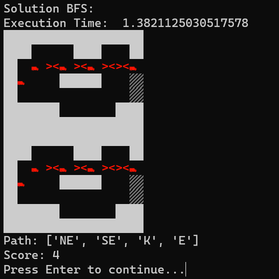

---

### DFS

DFS resultado do mapa 1 com distancia Manhattan

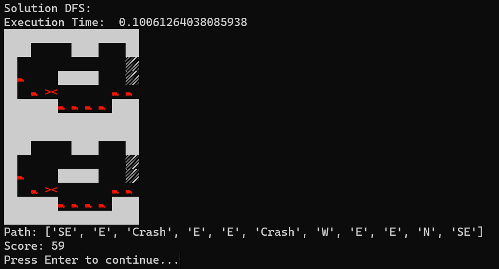

---

### Greedy

Greedy resultado do mapa 1 com distancia Manhattan

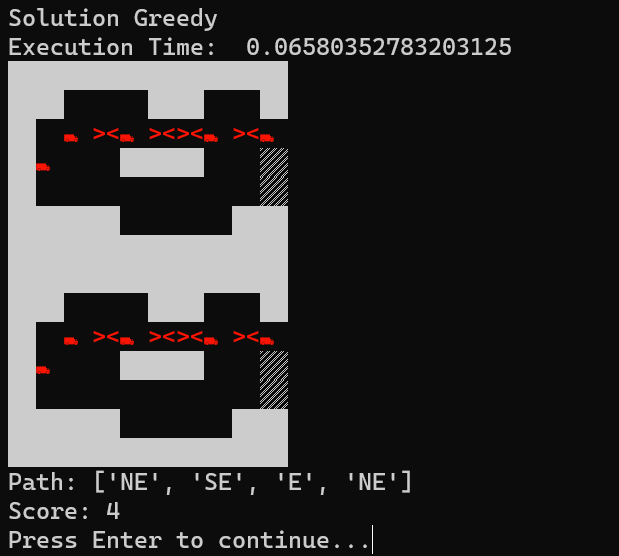

---

### Dijkstra

Dijkstra resultado do mapa 1 com distancia Manhattan

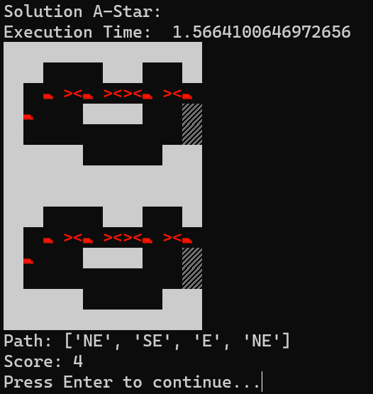

---

### A*

A* resultado do mapa 1 com distancia Manhattan

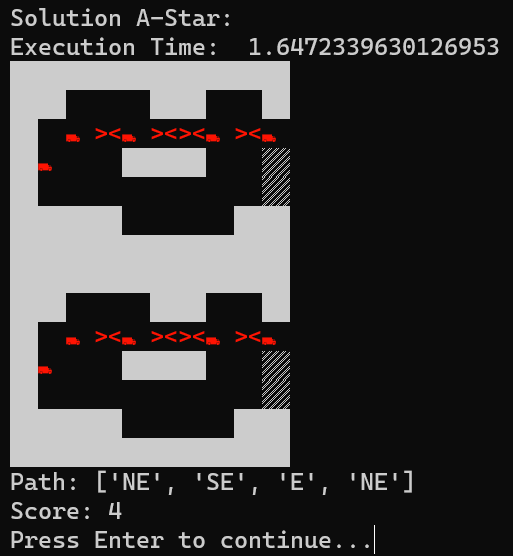

---

<div style="text-align: left; font-size: 27px">

### Representação do Método de Procura Graficamente

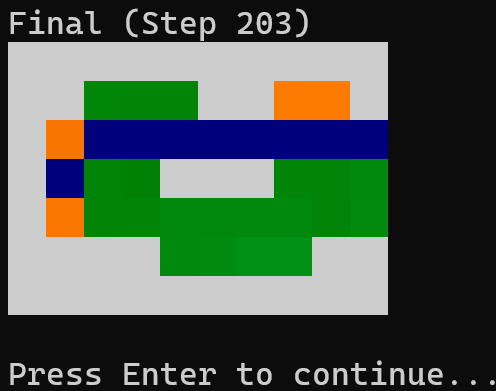

- A cor verde significa que existe pelo menos um nodo que pode ser verificado naquela coordenada do mapa;
- A cor laranja indica que não existe nenhum nodo aberto, porém já havia sido verificado;
- A cor vermelha representa a coordenada que esta a ser verificada.

<div>

---

<div style="text-align: left">

### Implementação de Vários Jogadores

- Estratégia Inicial
- Melhoramento do Sistema de Expansão
- Reconsideração da Estratégia
- Implementação Final para Ambientes Dinâmicos

<div>

---

##### Estratégia de *Collision Avoidance*


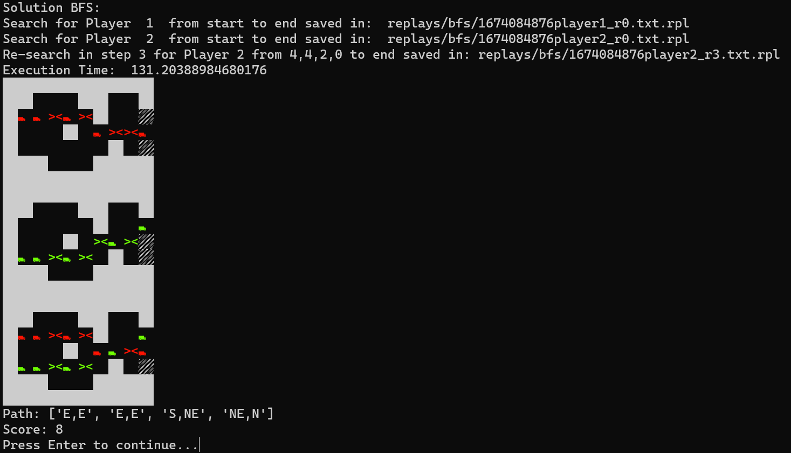


---

### Funcionamento

Menu da Aplicação

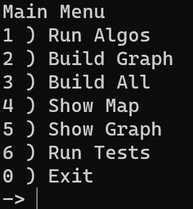


---

### Funcionamento

Solução de um dos algoritmos

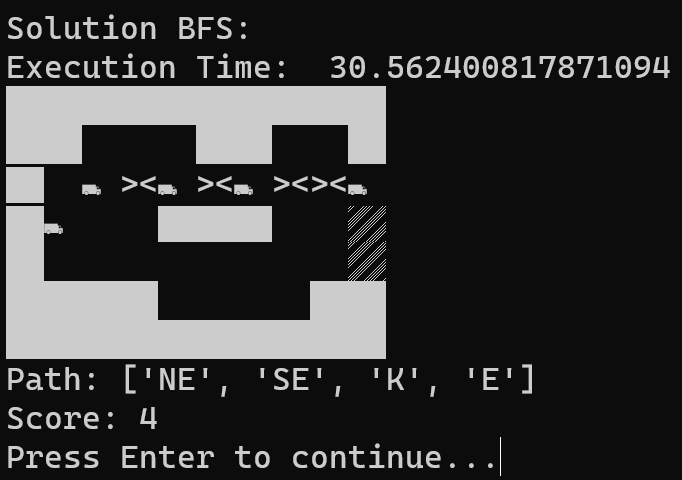


---

### Funcionamento

Representação gráfica da solução


---

### Funcionamento

Construção dos grafos para os diversos mapas

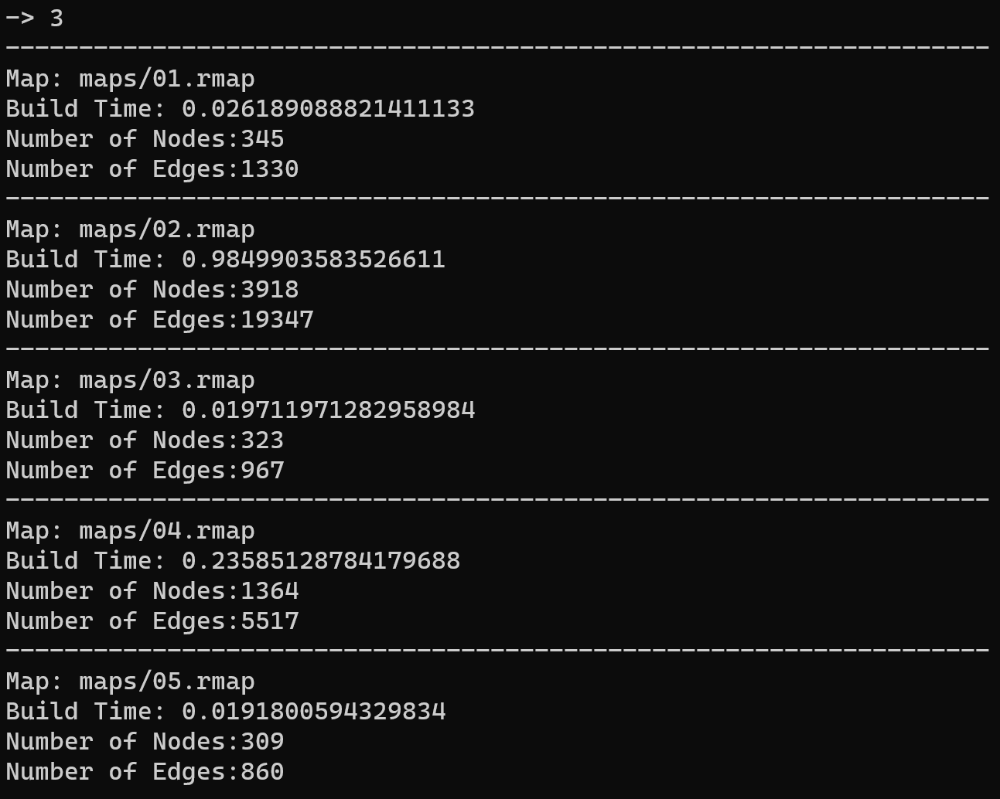

---

### Funcionamento

Soluções de todos os algoritmos aplicados a todos os mapas

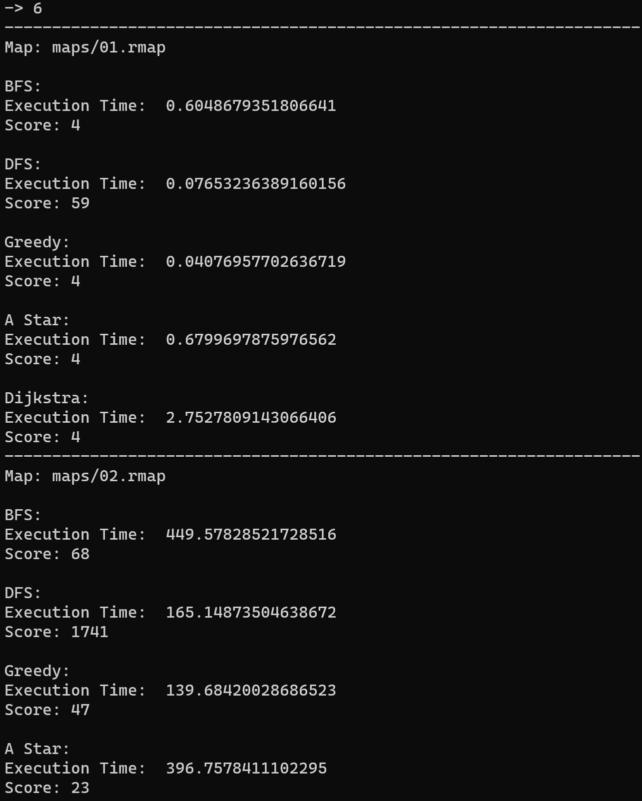

---

<div style="text-align: left">

### Conclusão

Com este trabalho sentimos que conseguimos alcançar os objetivos para propostos para a cadeira, bem como desenvolver um projeto sólido que demonstre a capacidade de algoritmos de procura, quer em ambientes estáticos, quer em ambientes dinâmicos.

<div>

---
# <!--fit-->Resolução de Problemas - Algoritmos de procura

<span style="color:grey">**Inteligência Artificial**</span>


Grupo 27

<div style="font-size: 24px">

Filipa Gomes (A96556)
Pedro Oliveira (A95076)
Ricardo Oliveira (A96794)
Rodrigo Freitas (A96547)

</div>
